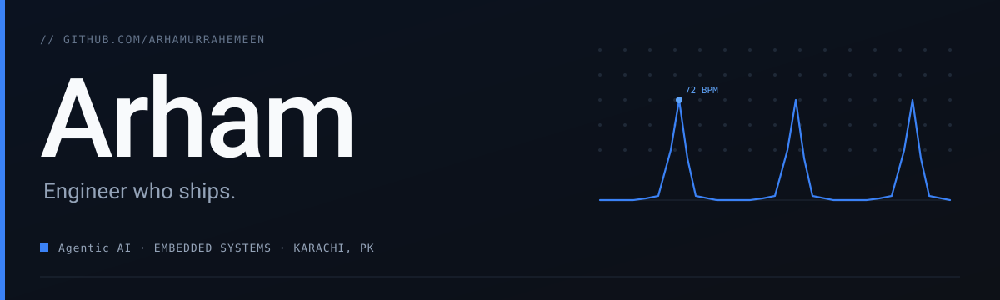
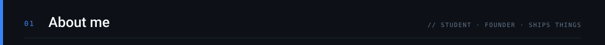
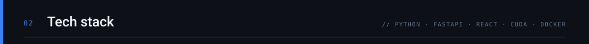
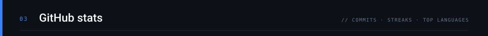
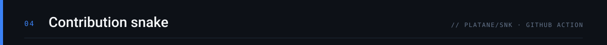
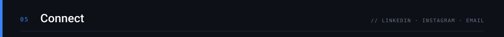

<!-- ================= HERO BANNER ================= -->

  

<!-- ================= TITLE ================= -->
<h1 align="center">Hey there, I'm Arham 👋</h1>

<!-- ================= TYPING SVG ================= -->

  

<!-- ================= BADGES ================= -->

  
  
  
  
  

 

<!-- ================= WINNER CARD ================= -->
<table align="center" width="90%">
  <tr>
    <td width="18%" align="center" valign="middle">
      
    </td>
    <td width="82%" valign="middle">
      <h3>2nd Runner-Up — ELXR'26, KSBL Karachi</h3>
      

        Placed 2nd runner-up at the <b>ELXR'26 National Hackathon</b> hosted by <b>Karachi School of Business & Leadership</b>
        with <a href="https://github.com/Arhamurrahemeen/TwinLab"><b>TwinLab</b></a> — an IIoT predictive
        maintenance platform for Pakistan's textile & FMCG plants, built under my startup <b>OmniteX</b>.
      

      

        Currently a finalist at both NIC Karachi and SEIC Karachi incubation programs.
      

      

        
      

    </td>
  </tr>
</table>

 

<!-- ================= LOOP CARD ================= -->
<table align="center" width="90%">
  <tr>
    <td width="18%" align="center" valign="middle">
      
    </td>
    <td width="82%" valign="middle">
      <h3>3rd Place — Social Nova Hackathon 2026, Habib University</h3>
      

        Built <a href="https://github.com/Arhamurrahemeen/Loop"><b>Loop</b></a> with a 4-person team — a proactive
        Android shield against scams and deepfakes: identify a suspicious link/message, verify a deepfake voice or
        video call, and flag family after a red verdict.
      

      

        Kotlin Android shell + Node.js backend, Groq for text checks, Gemini for image/video checks.
      

      

        
      

    </td>
  </tr>
</table>

 

<!-- ================= ABOUT ================= -->

  I'm <b>Muhammad Arham</b> — a Computer Systems Engineering student at <b>DUET Karachi</b> who spends most of his time shipping things.

<ul>
  <li>🏭 Founder & CEO of <b>OmniteX</b>, building <b>TwinLab</b> — IIoT predictive maintenance for Pakistan's textile & FMCG plants. <b>2nd Runner-Up, ELXR'26</b>.</li>
  <li>🛡️ Built <b>Loop</b> — an Android shield against scams & deepfakes. <b>3rd Place, Social Nova Hackathon 2026</b> (Habib University).</li>
  <li>🫀 Built <b>VitalSense</b> — camera-based real-time vital signs monitor using rPPG + DSP + LLMs.</li>
  <li>🧪 Documenting my methodology in <b>The-Arham-Way</b> — a blueprint-first approach to shipping full-stack apps with LLMs.</li>
  <li>📍 Karachi, Pakistan · 🎯 NIC Karachi & SEIC Karachi finalist</li>
</ul>

<i>"Compression over completeness. Ship first, polish later."</i>

 

<!-- ================= TECH STACK ================= -->

  

  

  

 

<!-- ================= FEATURED PROJECTS ================= -->

<table align="center" width="100%">
  <tr>
    <td width="50%" valign="top">
      <h3>🏭 <a href="https://github.com/Arhamurrahemeen/TwinLab">TwinLab</a></h3>
      
IIoT predictive maintenance for Pakistan's textile & FMCG plants. 2nd Runner-Up, ELXR'26.

      

        
        
        
      

    </td>
    <td width="50%" valign="top">
      <h3>🫀 <a href="https://github.com/Arhamurrahemeen/VitalSense">VitalSense</a></h3>
      
Camera-based real-time vital signs monitor using rPPG, DSP + LLMs. Heart rate, HRV, stress — no sensors.

      

        
        
        
      

    </td>
  </tr>
  <tr>
    <td width="50%" valign="top">
      <h3>🛡️ <a href="https://github.com/Arhamurrahemeen/Loop">Loop</a></h3>
      
Proactive Android shield against scams & deepfakes. 3rd Place, Social Nova Hackathon 2026.

      

        
        
        
      

    </td>
    <td width="50%" valign="top">
      <h3>🧪 <a href="https://github.com/Arhamurrahemeen/The-Arham-Way">The Arham Way</a></h3>
      
Blueprint-first methodology for building full-stack apps with Claude, Gemini, and other LLMs.

      

        
        
        
      

    </td>
  </tr>
</table>

 

<!-- ================= ACTIVITY ================= -->
<!--
  Streak SVG is rendered by our own workflow (.github/workflows/snake.yml, using
  the DenverCoder1/github-readme-streak-stats Action + our own repo token) and
  committed to the `output` branch every 12h, instead of hotlinking
  streak-stats.demolab.com — the shared public instance is frequently down or
  rate-limited and was intermittently serving an "API issue" error graphic.
-->

  

 

<!-- ================= SNAKE ================= -->

<!--
  REQUIRED SETUP for the snake (and the streak-stats SVG above) to render:
  1. Commit .github/workflows/snake.yml (provided alongside this README)
  2. Go to your repo → Settings → Actions → General → set Workflow permissions
     to "Read and write permissions" → Save
  3. Go to Actions tab → run the "Generate Profile Assets" workflow manually the first time
  4. That creates the `output` branch containing the SVGs referenced below
  See: https://github.com/Platane/snk
-->

  <picture>
    <source media="(prefers-color-scheme: dark)" srcset="https://raw.githubusercontent.com/Arhamurrahemeen/Arhamurrahemeen/output/github-contribution-grid-snake-dark.svg"/>
    <source media="(prefers-color-scheme: light)" srcset="https://raw.githubusercontent.com/Arhamurrahemeen/Arhamurrahemeen/output/github-contribution-grid-snake.svg"/>
    
  </picture>

 

<!-- ================= CONNECT ================= -->

  
  
  
  
  

 

<!-- ================= FOOTER ================= -->

  Built with ☕ and stubbornness · <a href="https://github.com/Arhamurrahemeen">@Arhamurrahemeen</a>

